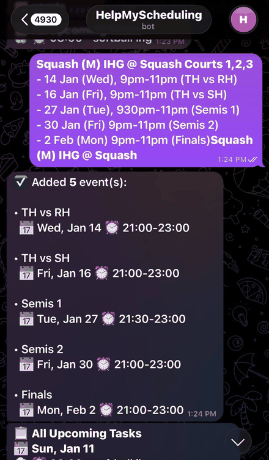

# HelpMyScheduling

A Telegram bot that turns a message like `lab moved to thursday 4pm` into a calendar entry.



I built it because my schedule lived in three different places and I kept double-booking myself. I didn't want another app to open, so it lives in Telegram, which I already had open all day anyway.

## What it does

- **Natural language intake.** Describe an event the way you'd say it out loud and it works out the title, date, time and location.
- **Editing and deleting.** "Move my lab to Thursday" works across several messages, with the bot asking for whatever it still needs.
- **Conflict detection.** Before anything is saved, the new event is checked against everything already scheduled, including an imported school timetable. Clashes come back with the option to keep both, replace, or cancel.
- **Reminders.** Per-event reminders plus a summary of tomorrow at 9pm each night.
- **Timetable import.** Drop in an `.ics` file and the weekly classes expand across the semester, skipping the weeks a class is cancelled.

## Stack

Node.js, SQLite, Telegram Bot API, OpenAI API, `node-ical`, `node-schedule`.

Four tables: events, recurrences, settings, and the imported school timetable.

## How it works

### The model is a parser, not an oracle

People don't type in a fixed format, so a rules-based parser would break on the next message. Instead the model turns messy text into structured JSON, with `temperature: 0` so the same message always behaves the same way, and JSON mode so the output is always parseable. Everything it returns is then validated in code, because a model being confident is not the same as it being right.

### Drafts expire

Scheduling something takes more than one message, so a half-built event sits in memory between them. Those drafts time out: 90 seconds while incomplete, 5 minutes once it's waiting on a confirmation.

Without the timeout, you wander off mid-conversation, come back an hour later, reply "yes" to something else, and the bot creates the wrong event. Expiring is the safe failure.

### Conflict detection

Two events clash when `newStart < existingEnd && existingStart < newEnd`. Every time is converted to minutes past midnight first, so the comparison is plain integer arithmetic rather than wrestling with date objects.

### Everything is scoped per chat

Every query is filtered by `chat_id`, so one person can never read or delete another person's events. Doing it in the query rather than as a check afterwards means it can't be forgotten.

## Running it

```bash
npm install
cp .env.example .env    # add your Telegram bot token and OpenAI API key
node bot.js
```

Get a bot token from [@BotFather](https://t.me/BotFather) on Telegram.
